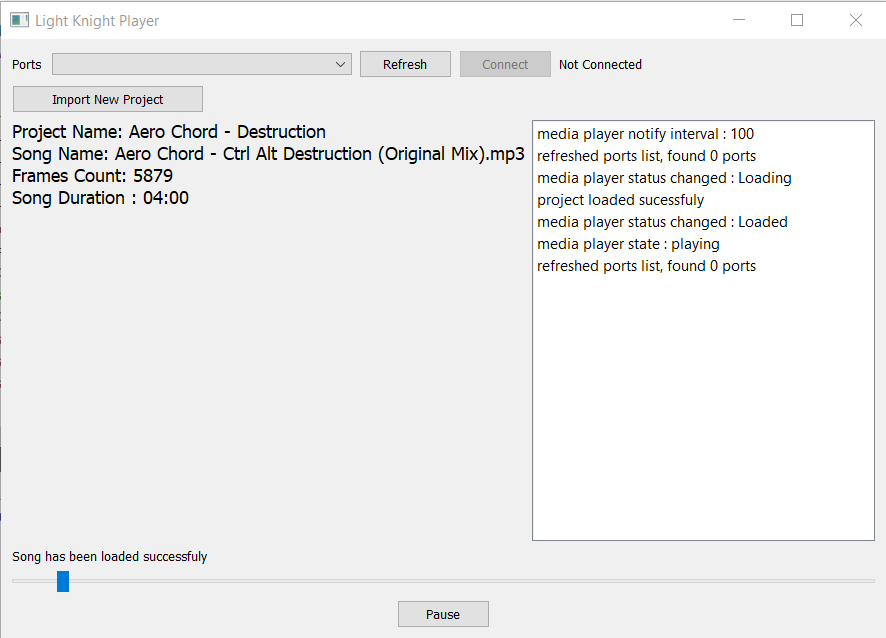
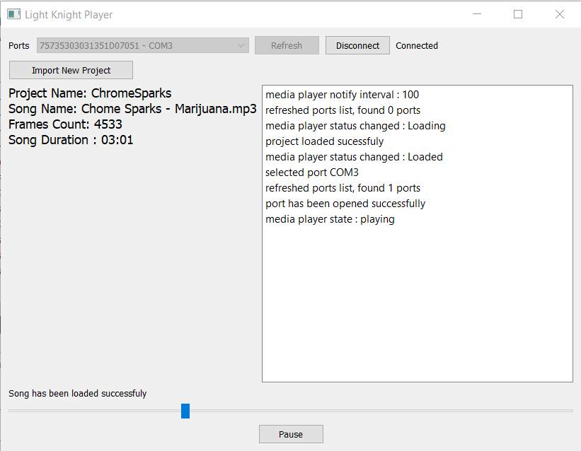

## What is this? 
this app will take in some project files produced by [LightKnight Animator](https://github.com/arg1998/LightKnight) then run those animations with an _Arduino Board_ over your LED strips. Simply, it's an interface.

## Requirements
  * Qt Creator >= 4.12
  * Arduino Board (tested on Uno and Mega boards)
  * Your Favorite OS (MacOS, Windows, Linux)
  * LED Strips and Related Hardwares 

## Instructions
- Build and Run the application via Qt Creator
- Click on **Import New Project** and select a LightKnight Project (Project Folder)
- Connect your arduino board 
- Refresh available ports if the board is not detected
- Connect to the port 
- Play!

If you encounter any unusual behavior, just restart the app ;-)

## Arduino Code Example
Compile and upload [two_rgb_channels_example.ino](Arduino/two_rgb_channels_example/two_rgb_channels_example.ino) to your Arduino (Uno R3 preferably) then open a **Two Channels** Animation (Animation with only two distinct LED strips). 

## Screenshots

